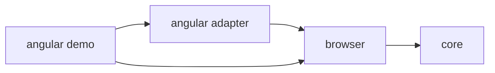

# Architettura iniziale

> Stato: sostituito dal technical design proposto per approvazione. Questo documento resta una sintesi; i dettagli sono in [`technical-design.md`](technical-design.md), [`schema-v1.md`](schema-v1.md) e negli ADR.

## Principi

- soluzione più semplice compatibile con correttezza ed evoluzione;
- dipendenze orientate verso il core;
- integrazioni framework isolate dietro contratti piccoli;
- comportamento development-only fail-safe;
- output e schema versionati;
- nessuna rete nel runtime predefinito;
- dipendenze runtime ridotte e giustificate.

## Confini proposti

```text
packages/
  core/       modello, redazione, sessione, schema e formatter
  browser/    estrazione DOM, overlay, eventi, pannello, clipboard e lifecycle
  angular/    resolver Angular e integrazione development-only
examples/
  angular-demo/
docs/
```

## Dipendenze



`core` non deve conoscere DOM, globali browser, Angular, clipboard o pannello. `browser` usa contratti del core e riceve un resolver. L’adapter Angular implementa quel contratto senza spostare logica framework-specifica negli altri package.

## Contratto concettuale del resolver

```ts
interface ComponentResolver {
  resolve(element: Element): ComponentReference | null;
}

interface ComponentReference {
  name: string;
  host: Element;
  selector?: string;
}
```

Il contratto definitivo dipenderà dal design dello schema `UiTarget` v1.

## Decisioni già approvate

- TypeScript;
- core indipendente dal framework;
- componente browser separato;
- primo adapter Angular;
- pacchetti npm come distribuzione iniziale;
- formati text e JSON versionato;
- sessione in memoria;
- licenza MIT;
- Chrome ed Edge come browser inizialmente supportati.

## Decisioni consolidate nel technical design

- pnpm workspace senza orchestratore aggiuntivo;
- TypeScript project references e `tsc --build`;
- ESM ES2022;
- Node 24 LTS;
- Angular 22 per la demo;
- Vitest e Playwright;
- redazione prima della sessione;
- query string e hash esclusi per default;
- boot no-op e file replacement per la demo production.

## Decisioni ancora aperte

- controllo effettivo dello scope npm `@ui-target-picker` prima della pubblicazione;
- size budget iniziale.

Il pannello usa uno Shadow DOM `open`. Shadow DOM dell’applicazione ospitante e iframe non vengono attraversati nell’MVP.

Queste decisioni devono essere registrate in ADR brevi prima dell’implementazione interessata.
