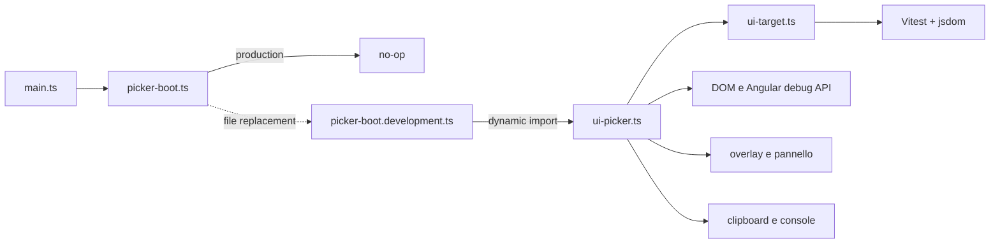

# Riferimento del prototipo — UX Picker in SerialOrders

> Documento storico del prototipo realizzato nel frontend Angular di SerialOrders. Non descrive lo stato corrente del repository **UI Target Picker** e non costituisce il contratto pubblico del nuovo prodotto.  
> Nome tecnico usato nel prototipo e nel formato di scambio: **UI Picker** / `UI-TARGET`.

I risultati, i percorsi sorgente e i comandi riportati in questo documento si riferiscono al progetto originale SerialOrders al 25 agosto 2026. Il relativo codice non è ancora presente in questo repository: le informazioni servono come evidenza e riferimento durante la nuova implementazione.

UX Picker trasforma un elemento visivo selezionato nel browser in un riferimento tecnico preciso, leggibile e incollabile in una conversazione con uno sviluppatore o un assistente AI.

Il problema che risolve è semplice: richieste come “modifica il riquadro arancione in basso” sono lente da interpretare e facili da associare al componente sbagliato. Con UX Picker, chi segnala una modifica seleziona direttamente l’elemento e ottiene rotta, gerarchia dei componenti, selettore, percorso DOM, semantica, testo e geometria della selezione.

> Lo screenshot originale del pannello non è ancora stato importato in questo repository.

## Indice

- [Cosa fa oggi](#cosa-fa-oggi)
- [Avvio e utilizzo](#avvio-e-utilizzo)
- [Formato prodotto](#formato-prodotto)
- [Significato dei campi](#significato-dei-campi)
- [Architettura](#architettura)
- [Come viene costruito un target](#come-viene-costruito-un-target)
- [Sessione, pannello e clipboard](#sessione-pannello-e-clipboard)
- [Esclusione dalla produzione](#esclusione-dalla-produzione)
- [Test e verifiche](#test-e-verifiche)
- [Privacy e sicurezza](#privacy-e-sicurezza)
- [Limiti attuali](#limiti-attuali)
- [Estrazione futura in un progetto GitHub](#estrazione-futura-in-un-progetto-github)
- [Troubleshooting](#troubleshooting)

## Cosa fa oggi

UX Picker offre quattro funzioni principali:

1. evidenzia l’elemento DOM sotto il puntatore con un overlay arancione;
2. identifica i componenti Angular che contengono l’elemento;
3. raccoglie più selezioni in una sessione ordinata e numerata;
4. copia automaticamente negli appunti l’intera sessione aggiornata.

Il risultato non è pensato come un selettore CSS eterno o come una registrazione completa del DOM. È un **pacchetto di contesto diagnostico**: abbastanza ricco da trovare rapidamente il codice interessato, ma abbastanza compatto da poter essere inserito in una richiesta.

### Funzioni disponibili

| Funzione | Comportamento |
|---|---|
| Evidenziazione | Disegna bordo, riempimento e nome del componente sopra il bersaglio corrente. |
| Cattura singola | `Alt+Click` aggiunge un elemento alla sessione. |
| Cattura continua | `Ctrl+Shift+E` abilita click consecutivi senza tenere premuto `Alt`. |
| Uscita dalla modalità continua | `Esc` interrompe la cattura continua senza cancellare la sessione. |
| Copia cumulativa | Dopo ogni cattura, la clipboard contiene tutti i target raccolti fino a quel momento. |
| Console fallback | Ogni sessione copiata viene scritta anche nella console del browser. |
| Pannello flottante | Mostra conteggio, schede numerate e dettagli completi. |
| Trascinamento | Il pannello può essere spostato tramite la barra superiore. |
| Posizione persistente | La posizione del pannello viene ricordata in `localStorage`. |
| Riduzione | Il pulsante `−` riduce il pannello alla sola testata; `+` lo riapre. |
| Rimozione | Ogni scheda può essere eliminata; le successive vengono rinumerate. |
| Svuotamento | `Svuota` azzera la sessione visibile. |
| Copia manuale | `Copia tutto` riscrive esplicitamente la sessione negli appunti. |

## Avvio e utilizzo

Il picker è disponibile soltanto nelle configurazioni Angular `development` e `lan`.

Dal frontend:

```bash
npm start

# oppure, per esporre l'applicazione sulla LAN
npm run start:lan
```

Se i `fileReplacements` di `angular.json` sono stati modificati mentre `ng serve` era già attivo, il server deve essere riavviato. Le normali modifiche successive ai file del picker vengono invece gestite dal rebuild di sviluppo.

### Comandi

| Comando | Risultato |
|---|---|
| Tieni premuto `Alt` | Arma temporaneamente il picker e mostra il bersaglio sotto il puntatore. |
| `Alt+Click` | Cattura il bersaglio, aggiunge la scheda e copia la sessione completa. |
| `Ctrl+Shift+E` | Attiva o disattiva la modalità di selezione continua. |
| Click in modalità continua | Aggiunge un nuovo bersaglio senza richiedere `Alt`. |
| `Esc` | Esce dalla modalità continua. |

I click di cattura vengono intercettati in fase di capture e non raggiungono l’applicazione. Se si seleziona un bottone, quindi, il bottone non viene anche attivato; se si seleziona un link, non avviene la navigazione.

## Formato prodotto

La clipboard contiene un documento testuale deterministico. La testata dichiara il numero totale di elementi, mentre ogni target riceve un indice progressivo.

```text
[UI-TARGETS]
totale:      3

[UI-TARGET 1]
catturato:   15:12:29
rotta:       /orders/import?job=2
componenti:  App > Shell > ImportPage > ImportRail > ImportProblemi
selettore:   app-import-problemi
elemento:    button.rail__groupheader
percorso DOM:ul.rail__grouplist > [data-testid="gruppo"] > [data-testid="gruppo-toggle"]
ruolo:       button
stato:       type="button", aria-expanded="false"
testo:       "Brand non riconosciuto «Dell» UNKNOWN_VENDOR Errore 1 riga"
riferimenti: data-testid="gruppo-toggle"
box:         353×54 px @ x:413, y:588 · viewport 1920×945
```

Le righe prive di valore vengono omesse. In questo modo un elemento senza ruolo, stato o testo non produce campi vuoti e il blocco resta denso.

## Significato dei campi

| Campo | Origine | Perché è utile |
|---|---|---|
| `catturato` | Ora locale, precisione al secondo | Ricostruisce l’ordine temporale di una sessione. |
| `rotta` | `pathname + search + hash` | Identifica pagina, query e frammento attivi. |
| `componenti` | Risalita degli host Angular | Restringe la ricerca alla gerarchia logica dell’applicazione. |
| `selettore` | Tag dell’host Angular più interno | Offre un aggancio diretto al componente che possiede il template. |
| `elemento` | Tag, ID e prime due classi significative | Firma breve del nodo cliccato. |
| `percorso DOM` | Percorso relativo all’host più interno | Distingue elementi simili nello stesso template. |
| `ruolo` | `role` esplicito o semantica HTML dedotta | Descrive la funzione accessibile del bersaglio. |
| `stato` | Tipo, nome e stati booleani/ARIA | Fotografa la condizione interattiva al momento del click. |
| `testo` | `textContent` normalizzato | Aiuta a riconoscere visivamente il bersaglio. |
| `riferimenti` | Attributi identificanti | Fornisce agganci stabili, soprattutto `data-testid`. |
| `box` | `getBoundingClientRect()` | Separa problemi dell’elemento da problemi del suo contenitore. |
| `viewport` | Dimensioni della finestra | Rende esplicito il contesto responsive. |
| `scroll` | `window.scrollX/Y` | Viene emesso soltanto quando la pagina non è nella posizione `0,0`. |

## Architettura

L’implementazione corrente separa deliberatamente logica pura, integrazione browser e bootstrap per ambiente.



### File coinvolti nel prototipo SerialOrders

I percorsi seguenti appartengono al repository originale e sono riportati come riferimenti storici; non sono link locali del nuovo progetto.

| File | Responsabilità |
|---|---|
| `frontend/src/main.ts` | Avvia Angular e chiama l’aggancio del picker. |
| `frontend/src/app/shared/dev/picker-boot.ts` | Implementazione sicura di default: no-op. |
| `frontend/src/app/shared/dev/picker-boot.development.ts` | Import dinamico del picker nelle configurazioni abilitate. |
| `frontend/src/app/shared/dev/ui-picker.ts` | Listener, overlay, sessione, pannello, clipboard e persistenza della posizione. |
| `frontend/src/app/shared/util/ui-target.ts` | Modello dati, estrazione deterministica e formattazione. |
| `frontend/src/app/shared/util/ui-target.spec.ts` | Test unitari della parte pura. |
| `frontend/angular.json` | `fileReplacements` per `development` e `lan`. |

### Perché la separazione è importante

`ui-target.ts` non accede direttamente a `window.ng`, non installa listener e non crea nodi reali dell’interfaccia. Riceve invece una funzione per risolvere il nome del componente. Questo permette di testare la parte più delicata con `jsdom` senza dover avviare Angular nel browser.

`ui-picker.ts` contiene invece tutto ciò che dipende da un browser vivo. Rimane intenzionalmente autonomo dal design system dell’applicazione e usa stili inline: deve funzionare anche se gli stili applicativi non sono ancora caricati e deve poter essere rimosso senza lasciare dipendenze negli SCSS di prodotto.

## Come viene costruito un target

### 1. Identificazione del componente Angular

Partendo dall’elemento cliccato, il picker risale `parentElement` fino alla radice del documento.

Per ogni elemento prova:

```ts
window.ng?.getComponent(element)
```

Questa API di debug è disponibile fuori produzione e restituisce l’istanza associata a un host Angular. Il nome viene letto da `instance.constructor.name`.

Se l’API non è disponibile o genera un errore, viene applicato un fallback sui tag che iniziano con `app-` o `wt-`:

```text
app-order-quick-search → OrderQuickSearch
wt-text-field         → TextField
```

I nomi vengono ordinati dal componente più esterno a quello più interno.

### 2. Normalizzazione del nome

Il bundler di sviluppo può anteporre underscore ai nomi delle classi:

```text
_Login → Login
__Icon → Icon
```

Gli underscore iniziali vengono rimossi perché non appartengono al nome presente nel sorgente e renderebbero meno efficace una ricerca nel repository. Gli underscore interni vengono conservati.

### 3. Firma dell’elemento

La firma utilizza:

1. nome del tag in minuscolo;
2. `#id`, quando presente;
3. le prime due classi significative.

Sono escluse le classi generate a runtime con prefissi:

```text
ng-
cdk-
_ngcontent
_nghost
```

Esempio:

```html
<button id="save" class="ng-star-inserted button button--primary button--large">
```

diventa:

```text
button#save.button.button--primary
```

### 4. Percorso DOM relativo

Il percorso si ferma all’host Angular più interno, evitando di copiare tutta la gerarchia della pagina.

Per ogni segmento viene preferito:

1. `[data-testid="..."]`;
2. `#id`;
3. firma tag/classi;
4. `:nth-of-type(n)` quando esistono fratelli con lo stesso tag.

`nth-of-type` distingue due nodi omonimi, ma viene aggiunto soltanto quando necessario.

### 5. Ruolo e stato

Il ruolo usa prima l’attributo `role`. In sua assenza vengono riconosciute le semantiche HTML più frequenti:

- `button` → `button`;
- `a[href]` → `link`;
- `select` → `combobox`;
- `textarea` e input testuali → `textbox`;
- input checkbox/radio → `checkbox` / `radio`.

Lo stato raccoglie solamente metadati utili:

```text
type
name
disabled
required
readonly
aria-checked
aria-expanded
aria-pressed
aria-selected
```

Il valore corrente di un input non viene letto.

### 6. Testo visibile

Il testo viene letto da `textContent`, gli spazi vengono collassati e il risultato viene troncato a 60 caratteri con ellissi.

Questa scelta mantiene il target riconoscibile senza trasformare la cattura in una trascrizione dell’intero contenuto di un pannello.

### 7. Attributi identificanti

Vengono raccolti, in ordine stabile:

```text
aria-label
title
placeholder
data-testid
```

`data-testid` è particolarmente prezioso perché può essere usato direttamente per trovare o scrivere un test.

### 8. Geometria e contesto responsive

`getBoundingClientRect()` fornisce posizione e dimensioni dell’elemento rispetto al viewport. Vengono aggiunte le dimensioni correnti della finestra e, quando diverso da zero, lo scroll della pagina.

Questi dati permettono di distinguere, per esempio, un’icona da 20 px dal bottone da 44 px che la contiene, oppure un difetto generale da un comportamento presente soltanto a una determinata larghezza.

## Sessione, pannello e clipboard

### Modello di sessione

La sessione è un array in memoria di `UiTarget`. Ogni nuova cattura viene aggiunta in coda e riceve il numero corrispondente alla sua posizione.

La sessione attuale:

- sopravvive ai cambi di rotta interni alla SPA;
- non sopravvive a un refresh completo della pagina;
- non viene inviata a server;
- non viene salvata in `localStorage`.

Soltanto la posizione del pannello viene memorizzata con la chiave:

```text
ui-picker-panel-position
```

### Sincronizzazione della clipboard

Dopo ogni cattura viene formattata nuovamente l’intera sessione:

```text
target 1 → clipboard: [1]
target 2 → clipboard: [1, 2]
target 3 → clipboard: [1, 2, 3]
```

Le scritture sono serializzate tramite una coda di Promise. Due click molto rapidi non possono quindi lasciare negli appunti una versione più vecchia della sessione a causa dell’ordine di completamento delle operazioni asincrone.

La strategia di copia è:

1. `navigator.clipboard.writeText()`;
2. fallback con textarea temporanea e `document.execCommand('copy')`;
3. stampa sempre disponibile tramite `console.info()`.

Quando viene rimosso un elemento, la clipboard viene aggiornata con i target rimasti. Quando la sessione viene svuotata o diventa vuota dopo una rimozione, la clipboard viene lasciata invariata: l’ultima cattura rimane recuperabile e non viene sostituita con una stringa vuota.

### Isolamento del pannello

Tutti i nodi del picker appartengono a una radice dedicata. Il resolver esclude l’intera radice dai bersagli selezionabili; il picker non può quindi catturare il proprio pannello, i pulsanti o il toast.

L’overlay usa uno `z-index` molto alto (`2147483000`) per rimanere sopra agli overlay applicativi, incluso il CDK.

### Ciclo di vita

`enableUiPicker()` è idempotente. Se viene chiamata più volte, restituisce il disposer dell’istanza esistente invece di installare listener duplicati. Il disposer:

- rimuove tutti i listener globali;
- ripristina il cursore;
- annulla il timer del toast;
- elimina la radice UI;
- permette una successiva inizializzazione pulita.

## Esclusione dalla produzione

L’esclusione non si basa su una condizione eseguita a runtime. Il modulo viene eliminato dal grafo degli import della build di produzione.

### Default sicuro

`main.ts` importa sempre `picker-boot.ts`, la cui implementazione standard non fa nulla:

```ts
export const bootUiPicker = (): void => undefined;
```

Le sole configurazioni `development` e `lan` sostituiscono quel file con `picker-boot.development.ts` tramite `fileReplacements` di Angular. La versione development esegue un import dinamico di `ui-picker.ts`.

Il default è quindi fail-safe: una nuova configurazione che dimentica il replacement ottiene il no-op, non il picker.

### Verifica della build

```bash
cd frontend
npm run build

rg "UI PICKER / SESSIONE|ui-picker-panel-position|SELEZIONE CONTINUA|\[UI-TARGETS\]" \
  dist/frontend -g '*.js'
```

Risultato verificato il 25 agosto 2026:

```text
PROD_PICKER_MATCHES=0
```

Questo dimostra che il codice non è semplicemente “non chiamato”: le firme specifiche del modulo non sono presenti nei chunk prodotti.

## Test e verifiche

La parte pura è coperta da 22 test Vitest su `jsdom`.

Le aree coperte comprendono:

- firma dell’elemento e filtraggio delle classi runtime;
- normalizzazione e troncamento del testo;
- raccolta ordinata degli attributi identificanti;
- costruzione del percorso DOM;
- disambiguazione con `nth-of-type`;
- ruolo e stato senza lettura del valore degli input;
- normalizzazione dei nomi Angular;
- risalita della catena dei componenti;
- formattazione completa e omissione dei campi vuoti;
- formattazione cumulativa e numerata della sessione.

Esecuzione mirata:

```bash
cd frontend
npx ng test --watch=false --include=src/app/shared/util/ui-target.spec.ts
```

Verifiche effettuate sull’implementazione corrente:

```text
TypeScript:             PASS
Test unitari:           22/22 PASS
Build produzione:       PASS
Firme picker in prod:   0
Browser reale:          2 catture, append, clipboard, drag, collapse e remove PASS
```

La parte browser non ha ancora una suite E2E permanente nel repository. È stata verificata con Playwright durante lo sviluppo, ma questo controllo va reso ripetibile prima di estrarre il progetto.

## Privacy e sicurezza

UX Picker produce contenuto destinato a essere incollato in chat. Per questo applica alcune esclusioni intenzionali:

- non legge `HTMLInputElement.value`;
- non legge il contenuto di password, email o campi compilati;
- non serializza `outerHTML`;
- non raccoglie proprietà o stato interno delle istanze Angular;
- non effettua richieste di rete;
- non persiste le selezioni;
- non viene incluso nella produzione.

Il testo visibile e alcuni attributi possono comunque contenere dati applicativi. Prima di condividere una sessione al di fuori del team va quindi verificato che il contenuto mostrato nella UI non contenga informazioni riservate.

## Limiti attuali

### Tecnici

- La risoluzione autorevole dei componenti è specifica di Angular e dipende da `window.ng.getComponent()`.
- Il fallback riconosce solamente selettori con prefisso `app-` e `wt-`.
- Il percorso DOM è diagnostico, non garantito come selettore stabile nel tempo.
- `nth-of-type` può cambiare quando cambia l’ordine dei fratelli.
- Non vengono attraversati Shadow DOM e iframe.
- Non vengono individuati file sorgente e numeri di riga.
- Il testo di un contenitore può includere quello di tutti i discendenti.
- Il ruolo implicito copre soltanto gli elementi HTML più comuni; non sostituisce il calcolo completo dell’accessible name/role del browser.
- La sessione vive soltanto nella scheda corrente.
- Non esiste ancora un limite massimo al numero di target raccolti.

### Di prodotto

- Il picker non invia automaticamente dati ad applicazioni di chat.
- Non allega screenshot del singolo elemento.
- Non consente ancora una nota libera per ogni target.
- Non permette di scegliere tra output testuale, JSON o Markdown.
- L’aspetto del pannello è hardcoded e non è ancora tematizzabile.
- Non esiste ancora una distribuzione installabile indipendente dall’app Angular.

## Ipotesi storica di estrazione

Questa sezione conserva la proposta formulata prima della creazione del nuovo repository. Le decisioni correnti e approvate sono documentate nel README di root e negli altri documenti della cartella `docs`.

### Direzione proposta

```text
packages/
  core/             modello, normalizzazione, path e formatter
  browser/          overlay, sessione, pannello e clipboard
  angular/          adapter window.ng + fallback dei selettori
  adapters/         futuri adapter React/Vue/Web Components
examples/
  angular-demo/
docs/
  architecture.md
  integrations.md
```

### Confini dei package

#### `@ux-picker/core`

Non dovrebbe dipendere da Angular e dovrebbe contenere:

- tipo `UiTarget` versionato;
- firma dell’elemento;
- normalizzazione testo;
- costruzione del percorso;
- estrazione di ruolo e stato;
- formatter text/Markdown/JSON;
- test unitari.

#### `@ux-picker/browser`

Dovrebbe occuparsi di:

- listener tastiera e puntatore;
- overlay;
- session store;
- clipboard;
- pannello flottante;
- lifecycle e disposer;
- configurazione di scorciatoie, colori e limiti.

#### `@ux-picker/angular`

Dovrebbe fornire soltanto l’adapter:

```ts
interface ComponentResolver {
  resolve(element: Element): {
    name: string;
    host: Element;
    selector?: string;
  } | null;
}
```

La stessa interfaccia permetterebbe successivamente adapter per React, Vue, Svelte o Web Components senza riscrivere overlay e sessione.

### Roadmap minima

#### Fase 1 — stabilizzazione interna

- aggiungere un limite configurabile di target;
- aggiungere esportazione JSON;
- introdurre note opzionali per sessione e target;
- rendere configurabili scorciatoie e prefissi dei selettori;
- aggiungere test permanenti Playwright;
- testare Chrome, Edge, Firefox e Safari.

#### Fase 2 — estrazione

- spostare il nucleo in package indipendenti;
- sostituire i riferimenti SerialOrders con opzioni;
- definire schema `UiTarget` con `version`;
- pubblicare un esempio Angular minimale;
- aggiungere build ESM e dichiarazioni TypeScript;
- preparare licenza, contribution guide e changelog.

#### Fase 3 — progetto pubblico

- repository GitHub autonomo;
- release semantiche;
- pacchetti npm;
- documentazione pubblica con demo GIF/video;
- matrice di compatibilità;
- integrazioni opzionali per issue tracker e assistenti AI.

### Decisioni da prendere prima della pubblicazione

1. **Nome definitivo:** `UX Picker`, `UI Target Picker` o altro nome disponibile su GitHub/npm.
2. **Licenza:** MIT, Apache-2.0 o altra licenza coerente con l’obiettivo del progetto.
3. **Perimetro:** solo Angular oppure core agnostico con adapter.
4. **Persistenza:** esclusivamente memoria oppure session storage opzionale.
5. **Formato pubblico:** testo umano come default e JSON versionato come contratto macchina.
6. **Privacy:** attributi ammessi, denylist e callback di redazione personalizzata.
7. **Distribuzione:** package npm, snippet development-only, estensione browser o combinazione dei tre.

## Troubleshooting

### Il picker non compare

1. verificare di usare `npm start` o `npm run start:lan`;
2. controllare che la configurazione scelta contenga il `fileReplacement`;
3. riavviare `ng serve` se `angular.json` è stato modificato dopo l’avvio;
4. cercare in console `[ui-picker] avvio fallito`.

### `Alt` non evidenzia nulla

- muovere il puntatore dopo aver premuto `Alt`;
- verificare che la finestra del browser abbia il focus;
- controllare che il sistema operativo non intercetti la combinazione;
- usare `Ctrl+Shift+E` come alternativa.

### La clipboard è negata

In contesti non sicuri, per esempio accesso LAN via HTTP, `navigator.clipboard` può essere indisponibile. Il picker prova il fallback legacy e stampa comunque la sessione nella console del browser.

### Il nome del componente manca

L’elemento può trovarsi fuori dall’albero Angular oppure l’API debug può non essere disponibile. Il fallback funziona solo per tag `app-*` e `wt-*`; il resto del target rimane comunque utilizzabile.

### Il percorso DOM cambia

Il percorso descrive la struttura al momento della cattura. Per test automatici durevoli va preferito un `data-testid` esplicito.

## Principio guida

UX Picker non tenta di sostituire DevTools, inspector di framework o test end-to-end. Il suo obiettivo è più stretto:

> trasformare un gesto visuale in un riferimento tecnico condivisibile, con il minor attrito possibile.

Questa limitazione di scopo è ciò che rende il progetto piccolo, utile e potenzialmente riutilizzabile al di fuori di SerialOrders.
