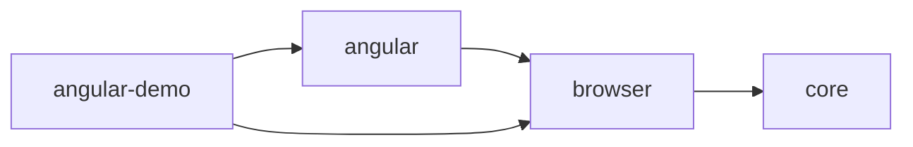

# Technical design — MVP

> Stato: approvato il 26 agosto 2026 e aggiornato dai finding di hardening. Le versioni citate dovranno essere ricontrollate prima dello scaffold.

## Fonti della baseline

- [Node.js release status](https://nodejs.org/en/about/previous-releases)
- [Compatibilità Angular, Node.js e TypeScript](https://angular.dev/reference/versions)
- [Release e supporto Angular](https://angular.dev/reference/releases)
- [pnpm workspaces](https://pnpm.io/workspaces)
- [TypeScript project references](https://www.typescriptlang.org/docs/handbook/project-references.html)
- [Angular debug global `getComponent`](https://angular.dev/api/core/globals/getComponent)
- [Browser Playwright](https://playwright.dev/docs/browsers)
- [Impostazioni di sicurezza pnpm](https://pnpm.io/settings)
- [GitHub dependency review](https://docs.github.com/en/code-security/concepts/supply-chain-security/dependency-review)
- [npm trusted publishing](https://docs.npmjs.com/trusted-publishers/)

## Baseline della toolchain

| Area | Decisione |
|---|---|
| Runtime di sviluppo | Node.js 24 LTS, minimo `24.15.0`. |
| Package manager | pnpm 11 tramite Corepack, versione fissata nel repository. |
| Workspace | pnpm workspace con protocollo `workspace:` e lockfile condiviso. |
| Linguaggio | TypeScript 6.0 in strict mode. |
| Output librerie | ESM, ES2022, dichiarazioni TypeScript e source map. |
| Build librerie | `tsc --build` con project references, `NodeNext` ed estensioni `.js` esplicite negli import relativi; nessun bundler aggiuntivo nell’MVP. |
| Demo | Angular 22, applicazione standalone. |
| Unit e integration test | Vitest 4 con jsdom. |
| E2E | Playwright su Google Chrome e Microsoft Edge stable. |
| Lint | ESLint flat config con typescript-eslint. |
| Formattazione | Prettier, separato dal lint. |
| CI | GitHub Actions con installazione frozen, typecheck, lint, test, build, E2E e pack verification. |

Node 24 è scelto perché è LTS e soddisfa la baseline di Angular 22. Node 26 è ancora Current e non viene usato come runtime principale. Il computer locale usa attualmente Node `22.13.0`, inferiore ai requisiti di Angular 22: dovrà essere aggiornato prima dello scaffold.

## Struttura del workspace

```text
packages/
  core/
    src/
    package.json
    tsconfig.json
  browser/
    src/
    package.json
    tsconfig.json
  angular/
    src/
    package.json
    tsconfig.json
examples/
  angular-demo/
docs/
  adr/
package.json
pnpm-workspace.yaml
pnpm-lock.yaml
tsconfig.base.json
tsconfig.json
```

Nomi npm provvisori:

- `@ui-target-picker/core`;
- `@ui-target-picker/browser`;
- `@ui-target-picker/angular`.

Lo scope deve essere verificato e controllato prima della prima pubblicazione. I package restano privati fino alla release alpha.

## Responsabilità dei package

### `core`

Non dipende dal DOM, da Angular o da globali browser. Contiene:

- modello `UiTargetSessionV1`;
- schema JSON v1;
- normalizzazione di stringhe già raccolte;
- contratti di redazione;
- session store in memoria;
- formatter text e JSON;
- errori e result type pubblici.

### `browser`

Dipende da `core` e contiene:

- lettura controllata del DOM;
- firma e percorso dell’elemento;
- ruolo e stato semantico;
- overlay;
- gestione di puntatore e tastiera;
- controller della sessione;
- pannello;
- clipboard;
- persistenza esclusiva della posizione del pannello;
- lifecycle e disposer.

### `angular`

Dipende dai contratti di `browser` e fornisce:

- feature detection delle Angular debug globals;
- risoluzione del componente e dell’owning component;
- risalita della gerarchia degli host;
- fallback configurabile sui selettori custom element;
- helper di integrazione development-only per Angular.

L’adapter non legge proprietà di dominio o stato interno dell’istanza. L’istanza restituita dalle debug globals viene usata soltanto per ricavare un nome normalizzato del costruttore.

## Regola delle dipendenze



- nessun ciclo tra workspace package;
- dipendenze locali dichiarate con `workspace:`;
- nessun deep import tra package;
- API pubblica esposta soltanto dagli entrypoint dichiarati in `exports`;
- ogni package dichiara `type: module` e `sideEffects: false`;
- nessun codice si avvia al top level dell’import.
- gli import relativi sorgente usano estensioni `.js`, così l’ESM emesso funziona anche senza un bundler;
- i tre package condividono la stessa versione durante l’alpha e vengono rilasciati insieme.

## API browser concettuale

```ts
interface UiTargetPickerController {
  enable(): void;
  disable(): void;
  destroy(): void;
  getState(): UiTargetPickerState;
  getSession(): Readonly<UiTargetSessionV1>;
  copy(format?: "text" | "json"): Promise<CopyResult>;
}

interface UiTargetPickerOptions {
  resolver?: ComponentResolver;
  shortcuts?: Partial<UiTargetPickerShortcuts>;
  privacy?: Partial<PrivacyPolicy>;
  maxTargets?: number;
  initialFormat?: "text" | "json";
}

function createUiTargetPicker(
  options?: UiTargetPickerOptions,
): UiTargetPickerController;
```

`createUiTargetPicker` non installa listener finché non viene chiamato `enable`. `enable`, `disable` e `destroy` sono idempotenti. Dopo `destroy`, il controller non può essere riattivato.

`getSession` restituisce uno snapshot profondamente immutabile che non condivide array o oggetti mutabili con lo store interno.

## Contratto del resolver

```ts
interface ComponentResolver {
  readonly adapter: string;
  resolve(element: Element): ComponentResolution | null;
}

interface ComponentResolution {
  readonly host: Element;
  readonly name: string;
  readonly selector?: string;
  readonly ancestry: readonly string[];
}
```

`host` serve soltanto durante l’estrazione del percorso DOM e non viene serializzato. Errori del resolver vengono isolati: il target DOM rimane catturabile e il pannello segnala la risoluzione mancante.

## Pipeline dei dati


I candidati grezzi non entrano mai nella sessione, nei log o negli eventi pubblici. La sessione conserva esclusivamente il modello già sanificato.

## Default privacy

- preset predefinito: `balanced`; preset `strict` disponibile per disabilitare testo e riferimenti;
- rotta: solo `pathname`;
- query string e hash: esclusi, opt-in con redazione obbligatoria;
- testo visibile: normalizzato, massimo 80 caratteri, configurabile fino a disabilitazione; sempre escluso da input, textarea, select, contenteditable e controlli equivalenti;
- attributi: allowlist `aria-label`, `title`, `placeholder`, `data-testid`;
- valori dei controlli: sempre esclusi e non riattivabili tramite configurazione generica;
- HTML, cookie, storage, rete e stato framework: esclusi;
- geometria: arrotondata a interi;
- callback di redazione applicata a ogni stringa candidata, incluso `pathname`, prima della memorizzazione.

Le opzioni non possono disabilitare gli invarianti assoluti, come la proibizione di leggere password o valori correnti dei controlli.

Il preset `balanced` conserva il rischio residuo che il testo già visibile contenga dati personali. Il rischio è ridotto da ambienti controllati, limite, redazione, anteprima e copia esplicita; viene dichiarato nella checklist di release. Il preset `strict` è raccomandato per staging con dati realistici.

La callback personalizzata riceve un candidato alla volta con tipo e percorso logico; non riceve `Element`, `Window`, storage, cookie o istanze framework. Essendo codice fornito dal consumer, rimane oltre il trust boundary del runtime.

## Strategia development-only

Il package non promette che una condizione runtime rimuova il codice dalla build. La strategia usa più livelli:

1. nessun side effect all’import;
2. inizializzazione esplicita;
3. entrypoint no-op disponibile come default sicuro;
4. demo Angular con file replacement: no-op di default e boot reale soltanto nelle configurazioni consentite;
5. import dinamico del runtime reale nel boot development;
6. controllo automatico di più firme indipendenti, entrypoint e riferimenti al runtime nei chunk della build production;
7. test E2E che dimostra l’assenza di UI e listener in production.

Le guide per i consumer devono dichiarare che un semplice `if (production)` runtime non costituisce prova di esclusione dal bundle.

## Sessione e concorrenza

- la sessione è ordinata e limitata;
- ogni cattura produce un target immutabile;
- tutte le mutazioni passano da un reducer sincrono con azioni tipizzate;
- rimozione e clear creano un singolo snapshot di undo, valido fino alla successiva mutazione della sessione o a `destroy`;
- le copie sono serializzate per impedire che una Promise più vecchia sovrascriva un risultato più recente;
- ogni comando copy cattura immediatamente lo snapshot sanificato e il conteggio a cui si riferisce;
- cambiare formato non modifica i target;
- la navigazione SPA non azzera la sessione;
- refresh, `destroy` e chiusura scheda la eliminano;
- posizione pannello e sessione usano store separati.

## Error handling

Gli errori pubblici sono discriminated union, non stringhe arbitrarie:

```ts
type PickerError =
  | { code: "CLIPBOARD_DENIED"; recoverable: true }
  | { code: "CLIPBOARD_UNAVAILABLE"; recoverable: true }
  | { code: "TARGET_NOT_SELECTABLE"; recoverable: true }
  | { code: "TARGET_LIMIT_REACHED"; recoverable: true }
  | { code: "RESOLVER_FAILED"; recoverable: true; adapter: string }
  | { code: "CONTROLLER_DESTROYED"; recoverable: false };
```

Il messaggio utente viene risolto dal layer browser, mantenendo il core indipendente dalla lingua.

## Strategia di test

### Core

- schema e type guard;
- normalizzazione;
- redazione;
- session store e limite;
- undo;
- formatter deterministici;
- omissione dei campi opzionali.

### Browser

- estrazione con jsdom;
- firma, percorso e semantica;
- esclusione valori sensibili;
- lifecycle idempotente;
- stato delle scorciatoie;
- concorrenza clipboard;
- pannello e focus.

### Angular adapter

- debug globals disponibili, assenti e fallite;
- `getComponent` e `getOwningComponent`;
- normalizzazione dei nomi;
- gerarchia degli host;
- fallback selector configurabile;
- nessuna lettura delle proprietà dell’istanza.

### E2E

- cattura singola, continua e da tastiera;
- esclusione del click applicativo;
- sessione, limite, rimozione, clear e undo;
- copia text e JSON;
- clipboard negata;
- accessibilità e focus;
- navigazione SPA e refresh;
- build development e production;
- Chrome e Edge stable reali, non soltanto Chromium generico.

## Pipeline CI

```text
install --frozen-lockfile
  → format:check
  → lint
  → typecheck / tsc --build
  → unit + integration + coverage
  → build packages
  → build angular demo development/production
  → production exclusion check
  → E2E Chrome/Edge
  → pnpm pack + install smoke test
```

Il pack smoke test installa i tarball prodotti in un consumer temporaneo e verifica entrypoint, tipi e assenza di file sorgente non previsti.

## Supply chain e pubblicazione

- lockfile obbligatorio e installazione frozen in CI;
- `minimumReleaseAge` pnpm iniziale di 1440 minuti, con eccezioni motivate e versionate;
- script di installazione consentiti tramite allowlist, senza autorizzazione globale;
- dependency review sulle pull request con soglia `moderate`;
- azioni GitHub fissate a commit e aggiornate tramite Dependabot;
- package packati e verificati prima della pubblicazione;
- pubblicazione tramite npm trusted publishing da GitHub Actions, senza token persistente e con provenance automatica;
- branch e release environment protetti prima della prima alpha pubblica.

## Criteri del gate tecnico

- schema v1 approvato;
- confini e dipendenze dei package approvati;
- default privacy approvati;
- strategia development-only verificabile;
- test strategy tracciabile ai requisiti;
- nessuna decisione tecnica critica ancora implicita;
- prerequisito Node aggiornato prima dello scaffold.
