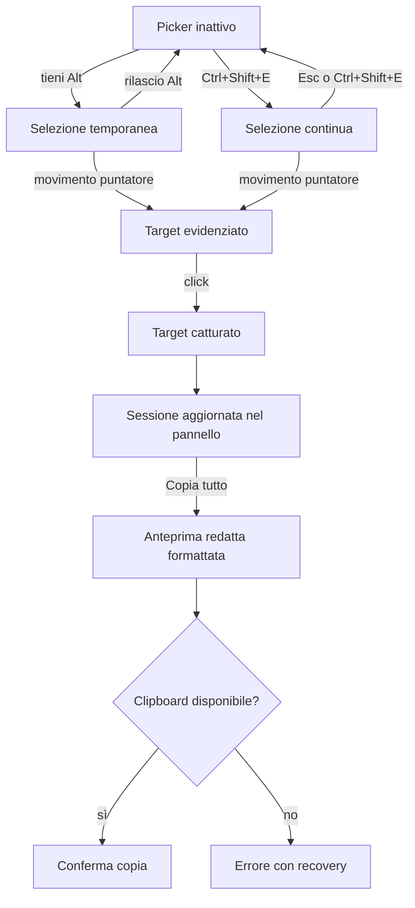

# Product e UX design — MVP

> Stato: approvato il 26 agosto 2026. Il documento traduce i requisiti approvati in flussi e comportamenti osservabili; non prescrive l’implementazione tecnica.

## Obiettivi dell’esperienza

- rendere immediatamente evidente se il picker è inattivo, temporaneamente armato o in cattura continua;
- permettere la prima selezione senza configurazione;
- non attivare accidentalmente l’elemento applicativo selezionato;
- mantenere visibili i dati che verranno copiati;
- non sovrascrivere automaticamente la clipboard;
- offrire un percorso di recupero per ogni errore o azione distruttiva;
- restare distinguibile ma non invadente rispetto all’applicazione ospitante.

## User journey principale

## Modello di stato del picker

| Stato | Indicazione | Interazione |
|---|---|---|
| Inattivo | Pannello neutro; nessun overlay. | L’applicazione ospitante funziona normalmente. |
| Armato temporaneamente | Etichetta “Selezione temporanea”; overlay sul target corrente. | Vale soltanto mentre `Alt` è premuto. |
| Selezione continua | Etichetta persistente “Selezione continua attiva”; overlay sul target. | Ogni click valido cattura; `Esc` o la scorciatoia disattivano. |
| Cattura in corso | Feedback immediato sul target; nessun blocco prolungato. | Il click non raggiunge l’applicazione. |
| Limite raggiunto | Stato warning testuale nel pannello. | Nuove catture rifiutate fino alla rimozione di almeno un target. |
| Errore recuperabile | Messaggio con causa e azione disponibile. | Il picker rimane utilizzabile quando possibile. |
| Disabilitato | UI e listener rimossi. | Nessuna intercettazione dell’applicazione. |

Il colore non deve essere l’unico segnale di stato: ogni condizione attiva, warning o errore usa anche testo e, dove utile, un’icona accessibile.

## Scorciatoie

| Azione | Default | Regola |
|---|---|---|
| Selezione temporanea | Tieni premuto `Alt` | Configurabile; non deve impedire l’alternativa continua. |
| Attiva/disattiva selezione continua | `Ctrl+Shift+E` | Configurabile e mostrata nel pannello. |
| Cattura elemento focalizzato | `Ctrl+Shift+Enter` | Configurabile; disponibile quando il focus è su un elemento selezionabile dell’applicazione. |
| Esci dalla selezione continua | `Esc` | Non cancella la sessione. |

Le scorciatoie non si attivano durante la composizione IME e devono evitare di interferire con campi editabili. Se una combinazione è già occupata dall’applicazione, l’integratore può sostituirla.

## Pannello flottante

### Gerarchia

1. **Testata:** nome, stato del picker, conteggio `N/20`, riduci/espandi.
2. **Azioni principali:** `Copia tutto` come unica azione primaria; scelta formato `Testo` o `JSON` adiacente.
3. **Sessione:** schede numerate in ordine di cattura.
4. **Azioni secondarie:** `Svuota sessione` e ripristino della posizione del pannello.
5. **Regione di feedback:** conferme, warning ed errori annunciati senza spostare il focus.

### Scheda target

La versione compatta mostra:

- indice;
- componente più interno o firma dell’elemento;
- rotta abbreviata;
- testo riconoscibile, se ammesso;
- stato di eventuale redazione;
- controllo espandi/riduci;
- controllo rimuovi con nome accessibile.

La versione espansa mostra tutti i campi che entreranno nell’output. I valori lunghi vanno a capo; non si usa il troncamento come unico modo di consultazione.

### Posizione e dimensioni

- posizione iniziale: angolo in basso a destra con margine dal viewport;
- larghezza desktop contenuta e altezza massima legata al viewport;
- lista interna scrollabile soltanto quando necessario;
- su viewport stretti: pannello ancorato ai bordi con margini, senza scroll orizzontale;
- il pannello non deve coprire permanentemente l’intero contenuto ospitante;
- la posizione viene ricordata solo localmente e separatamente dalla sessione;
- se il viewport cambia, una posizione fuori schermo viene ricondotta nell’area visibile.

Il trascinamento parte soltanto dalla testata e usa una soglia per evitare movimenti accidentali. La testata focalizzata supporta anche le frecce per piccoli spostamenti e `Shift` più freccia per spostamenti maggiori. `Ripristina posizione` garantisce sempre un recupero.

## Gestione della sessione

- massimo predefinito: 20 target, configurabile dall’integratore;
- l’ordine corrisponde alla cattura;
- la stessa porzione di UI può essere catturata più volte perché stato, rotta o geometria possono cambiare;
- la navigazione interna SPA conserva la sessione;
- refresh, chiusura della scheda o disposer eliminano la sessione;
- nessuna sessione viene salvata in storage;
- la posizione del pannello può essere salvata, ma non contiene dati dei target.

La rimozione singola e lo svuotamento creano un solo livello di `Annulla`, visibile nel pannello fino alla successiva mutazione della sessione. Non esiste un timeout che possa penalizzare chi usa tastiera o screen reader. Lo svuotamento deve comunicare chiaramente il numero di target rimossi.

## Clipboard e formati

- nessuna copia automatica alla cattura;
- `Copia tutto` usa il formato selezionato;
- formato iniziale: `Testo`;
- `JSON` è disponibile come scelta esplicita;
- redazione e normalizzazione avvengono prima dell’anteprima e della copia;
- la copia riuscita non cambia focus e produce una conferma non invasiva;
- la copia fallita mostra causa comprensibile e recovery.

Il fallback della clipboard non deve ampliare i dati raccolti. Se nessun metodo è disponibile, il pannello apre una vista con output già redatto in un controllo read-only selezionabile, titolo e istruzioni. Il focus entra nella vista e torna al pulsante `Copia tutto` quando viene chiusa.

## Stati e recovery

| Scenario | Comportamento | Microcopy proposta |
|---|---|---|
| Sessione vuota | Spiega come iniziare e mostra le scorciatoie correnti. | “Nessun target. Tieni premuto Alt e seleziona un elemento.” |
| Target catturato | Aggiunge la scheda, aggiorna conteggio e annuncia il risultato. | “Target 3 aggiunto.” |
| Limite raggiunto | Non cattura e indica la soluzione. | “Limite di 20 target raggiunto. Rimuovine uno per continuare.” |
| Copia riuscita | Conferma quantità e formato. | “Copiati 3 target in formato Testo.” |
| Permesso clipboard negato | Mantiene l’output disponibile e offre selezione manuale. | “Accesso alla clipboard negato. Seleziona e copia manualmente l’output.” |
| Clipboard non disponibile | Mostra il fallback manuale. | “Clipboard non disponibile in questo contesto.” |
| Resolver Angular assente | Cattura il contesto DOM e segnala il dato mancante senza fallire. | “Componente Angular non rilevato; target DOM salvato.” |
| Target non valido | Nessuna scheda; il picker resta attivo. | “Questo elemento non può essere selezionato.” |
| Target rimosso | Rinumera la sessione e offre undo. | “Target rimosso. Annulla” |
| Sessione svuotata | Mantiene il picker attivo e offre undo. | “Rimossi 8 target. Annulla” |
| Posizione ripristinata | Riporta il pannello nell’angolo iniziale. | “Posizione del pannello ripristinata.” |

I messaggi devono indicare causa e possibilità di recupero. Nessun errore deve essere comunicato esclusivamente in console.

## Accessibilità

### Tastiera e focus

- tutte le azioni del pannello usano controlli semantici e sono raggiungibili da tastiera;
- l’ordine di tabulazione segue l’ordine visuale;
- un utente può catturare l’elemento applicativo attualmente focalizzato senza usare il puntatore;
- l’attivazione del picker e la cattura non spostano automaticamente il focus;
- il focus è sempre visibile con un indicatore ad alto contrasto;
- `Esc` esce dalla selezione continua ma non chiude o cancella dati;
- espansione, formato e stato continuo espongono semanticamente il proprio stato;
- il trascinamento non è l’unico modo per recuperare o posizionare il pannello.

### Screen reader

- testata del pannello identificata come regione complementare con nome “UI Target Picker”;
- aggiornamenti non critici annunciati tramite regione live educata;
- errori che richiedono intervento annunciati come alert senza rubare il focus;
- pulsanti con sola icona dotati di nome accessibile;
- schede numerate con etichetta che include indice e target riconoscibile.

### Aspetto e movimento

- contrasto minimo 4.5:1 per testo normale e 3:1 per componenti e testo grande;
- informazioni mai affidate al solo colore;
- layout utilizzabile con zoom browser al 200%;
- movimento limitato a feedback funzionale, circa 150–250 ms;
- `prefers-reduced-motion` elimina gli spostamenti animati non necessari;
- animazioni basate su `transform` e `opacity`, senza spostare il layout ospitante;
- font di sistema: nessun caricamento remoto e nessuna dipendenza dal font dell’applicazione.

## Direzione visuale

Il pannello è uno strumento tecnico incorporato: compatto, neutro e ad alto contrasto. Usa una superficie autonoma, token semantici e un accento riconoscibile per overlay e focus. Evita gradienti decorativi, trasparenze che riducono la leggibilità, ombre pesanti ed emoji come icone.

La palette definitiva verrà approvata tramite verifica di contrasto in light e dark host. Il pannello non deve ereditare colori o stili che possano renderlo inutilizzabile nell’applicazione ospitante.

## Stati esclusi dall’MVP

- upload o sincronizzazione;
- autenticazione;
- offline/online, perché il runtime non usa la rete;
- screenshot;
- annotazioni grafiche;
- modifica manuale del JSON;
- supporto touch dichiarato.

La cattura da tastiera dell’MVP è limitata agli elementi che possono ricevere focus. L’esplorazione da tastiera di qualsiasi nodo non focalizzabile richiederebbe un albero DOM dedicato ed è fuori perimetro.

## Verifica UX richiesta

- flusso completo con mouse e sola tastiera;
- screen reader almeno sul browser principale;
- zoom 200%;
- contrasto di testo, icone, focus, warning ed errori;
- `prefers-reduced-motion`;
- viewport desktop piccolo e grande;
- pannello trascinato fuori area e successivo recupero;
- lista vuota, 1 target, 20 target e limite superato;
- testi, selettori e rotte anormalmente lunghi;
- clipboard concessa, negata e indisponibile;
- navigazione SPA e refresh;
- host con z-index elevati, tema chiaro e tema scuro.

## Gate della fase

Il Product e UX design è approvabile quando:

- user journey e modello di stato sono accettati;
- microcopy e recovery non presentano ambiguità critiche;
- tutte le azioni del pannello hanno un’alternativa da tastiera e la cattura del focus applicativo è disponibile;
- gli stati vuoto, successo, warning, errore, limite e permesso negato sono rappresentati;
- i requisiti sono tracciabili verso il design tecnico e i test.
